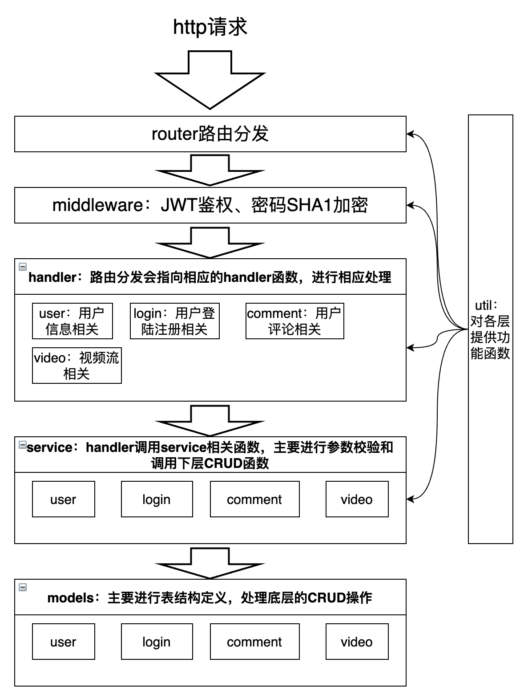
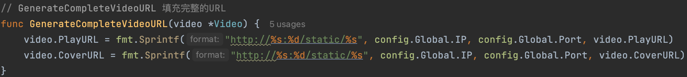
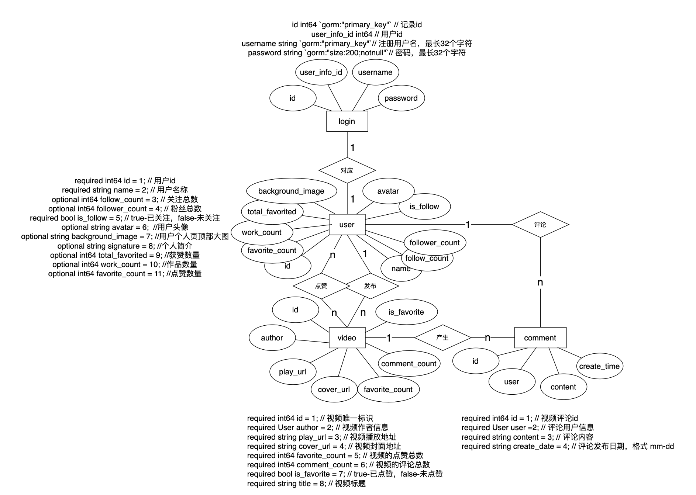

# 极简版抖音使用说明

## 注意！！本项目缺少lib文件夹（内含ffmpeg），请自行根据系统版本下载，并更改config下config.go的相关文件路径

## 一、命名规则

- 包名：全小写，单个单词，且为单数
- 文件名：全小写，下划线连接
- 结构体名：大驼峰命名法
- 接口名：大驼峰命名法
- 变量名：小驼峰命名法
- 函数名：大驼峰命名法
- 常量名：全大写，下划线连接
- 若以上名词中包含专有名词等特殊名称，采用全大写或全小写（如URL、ID、DAO、OK）

## 二、必要文件结构

```shell
concise_douyin
├── cache
├── config
├── handlers
│   ├── comment
│   ├── login
│   ├── user
│   └── video
├── lib
├── middleware
├── model
├── router
├── sßervice
│   ├── comment
│   ├── login
│   ├── user
│   └── video
├── static
│   ├── avatar-default.jpg
│   └── background_image-default.jpg
├── util
├── go.sum
├── main.go
└── go.mod
```

lib下存放ffmpeg等视频切片工具，需根据系统在config中修改参数（后面[项目运行](#四、项目运行)会讲到），由main.go启动本项目。

其中，`static`文件夹下存放视频文件、视频切片封面、用户头像、用户主页背景等资源文件，通过`router/router_interaction.go`中的`r.Static("static", config.Global.StaticSourcePath)`开放访问。


## 三、系统架构

系统基本架构如下



#### Handler层

主要完成三个步骤：

1. 解析得到请求参数
2. 调用service层函数，执行请求过程
3. 返回响应信息

#### Service层

主要完成三个步骤：

1. 检查参数
2. 调用Models层进行数据操作
3. 返回结果

#### Models层

根据service层的各种要求，设计对应的数据库操作函数


#### 以用户登陆流程为例：

1. 收到登录的HTTP请求
2. 进入中间件SHAMiddleWare内的函数逻辑，得到password明文，加密后再设置password。具体需要调用gin.Context的Set方法设置password。随后调用next()方法继续下层路由。
3. 进入UserLoginHandler函数逻辑，获取username，并调用gin.Context的Get方法得到中间件设置的password。再调用service层的QueryUserLogin函数。
4. 进入QueryUserLogin函数逻辑，执行三个过程：checkNum，prepareData，packData。也就是检查参数、准备数据、打包数据，准备数据的过程中会调用models层的UserLoginDAO。
5. 进入UserLoginDAO的逻辑，执行最终的数据库请求过程，返回给上层。


视频文件名与封面切片文件名由`util/video.go`中的`NewFileName`函数生成。由于存入数据库的只有文件名，因此在Model层中增加了完整URL生成函数，以video为例：

```go
// GenerateCompleteVideoURL 填充完整的URL
func GenerateCompleteVideoURL(video *Video) {
	video.PlayURL = fmt.Sprintf("http://%s:%d/static/%s", config.Global.IP, config.Global.Port, video.PlayURL)
	video.CoverURL = fmt.Sprintf("http://%s:%d/static/%s", config.Global.IP, config.Global.Port, video.CoverURL)
}
```



因此如想修改文件的存储地址可修改`model`文件夹下`video.go`与`user_info.go`中的相应函数

## 四、表结构设计

本项目的表结构如下：



其中，用户登陆信息与用户信息为一对一关系，用户与视频既有一对多的发布关系，也存在多对多的点赞关系。

- user_logins：存下用户的用户名和密码

- user_infos：存下用户的基本信息

- videos：存下视频的基本信息

- comment：存下每个评论的基本信息

对于一对一、一对多的关系，只需在表中引用外键即可，但对于多对多的关系，需要创建连接表。如用户与视频的点赞关系是多对多的关系，本项目的连接表由GORM自动创建名为的“user_favor_videos”的表，内含“user_info_id”与"video_id"两个外键。

所有数据表管理操作都由GORM来完成，具体逻辑在Model层中的init_db.go中实现，关键代码如下：

```
func InitDB() {
	var err error
	database, err = gorm.Open(mysql.Open(config.DBConnectString()), &gorm.Config{
		PrepareStmt:            true, //缓存预编译命令
		SkipDefaultTransaction: true, //禁用默认事务操作
		//Logger:                 logger.Default.LogMode(logger.Global), //打印sql语句
	})
	if err != nil {
		panic(err)
	}
	err = database.AutoMigrate(&UserInfo{}, &Video{}, &Comment{}, &UserLogin{})
	if err != nil {
		panic(err)
	}
}
```


## 五、项目运行

在mysql数据库中创建名为douyin的数据库[也可自定义创建数据库，修改config对应内容即可]

进入config目录更改对应的mysql、redis、server、path信息。

- `mysql`：`mysql`相关的配置信息
- `redis`：`redis`相关配置信息
- `server`：当前服务器（当前启动的机器）的配置信息，用于生成对应的视频和图片链接
- `path`：其中`ffmpeg_path`为lib里的文件路径，`windows` 需要使用`./lib/ffmpeg.exe`，mac选择没有exe的，static_source_path为本项目的static目录，这里请根据本地的绝对路径进行更改

